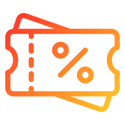

# promo-codes

Create a page for distributing your promo codes

## Setup Google Sheets API

Under the hood, this uses Google sheet API. So you'll need to set it up.

Follow these instructions: [Google Sheet API setup](https://github.com/jacklehamster/google-sheet-db?tab=readme-ov-file#setup)

## Github Source

<https://github.com/jacklehamster/@dobuki/promo-codes/>
